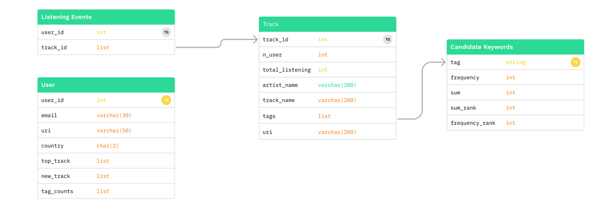

 
  
  <h1> 초개인화 음악 추천 서비스 'Au-Dionysos'🍷 </h1>
  <h3> Don't ruin my mood😜! </h3>
  Au-Dionysos는 당신의 상황, 감정, 취향을 반영한 플레이리스트를 생성해드립니다. 
  당신의 이야기를 들려주세요. 
  저희는 당신에게 공감해 멋진 노래🎶를 선물해드릴게요💝 

 

 
  
 
 
  
  
 
 

  

## 📌개요
사용자의 취향을 담은 태그와 사용자의 감정과 상황을 담은 텍스트를 활용하여  
취향 + 감정 + 상황을 모두 반영하는 개인 맞춤형 음악 추천 서비스🎧
  

   

## ✏️배경
이른바 부캐의 시대. 한 사람의 내면 안에 시간, 장소, 상황에 따른 다양한 자아가 존재합니다.  
하지만 기존의 음악 스트리밍 서비스에서는 실시간으로 달라지는 취향과 니즈를 모두 반영하는 것은 어렵습니다.  
그에 따라, 선곡 리스트, 유튜브 플레이리스트 등 누군가가 큐레이팅한 플레이리스트를 이용하는 사용자들이 증가하고 있습니다.  
  

## 💬기대효과
- 사용자의 감정과 상황 정확하고 세세하게 반영
- 초개인화 경험 제공
- 사용자의 시간 절약
- 사용자의 serendipity 실현
  

## 📚서비스 아키텍처

  

## 📚데이터베이스 구조

 

## 📚모델 아키텍처

 

 

## ✨팀 소개
 
<table align="left">
  <tr height="155px">
    <td align="center" width="150px">
      
    </td>
    <td align="center" width="150px">
      
    </td>
    <td align="center" width="150px">
      
    </td>
    <td align="center" width="150px">
      
    </td>
    <td align="center" width="150px">
      
    </td>
    <td align="center" width="150px">
      
    </td>
  </tr>
  <tr height="80px">
    <td align="center" width="150px">
      <a href="https://github.com/ksb3966">김수빈_T6021</a>
    </td>
    <td align="center" width="150px">
      <a href="https://github.com/SiwooPark00">박시우_T6060</a>
    </td>
    <td align="center" width="150px">
      <a href="https://github.com/arctic890">백승빈_T6075</a>
    </td>
    <td align="center" width="150px">
      <a href="https://github.com/JaeGwon-Lee">이재권_T6131</a>
    </td>
    <td align="center" width="150px">
      <a href="https://github.com/jinmin111">이진민_T6139</a>
    </td>
    <td align="center" width="150px">
      <a href="https://github.com/chris3427">장재원_T6149</a>
    </td>
  </tr>
</table>
&nbsp;
 

## 📓역할

| 이름 | 역할 |
| --- | --- |
| 김수빈 | 프로젝트 기획, LangChain 기반 Chat2Tag 모델 구현, 데이터-모델 파이프라인 설계 |
| 박시우 | 데이터 수집 및 전처리, DB 구축 및 백엔드 구현, UI 태그 추천 로직 구현 |
| 백승빈 | 프론트엔드 구현, 서버 관리 및 서비스 배포, 서비스 테스트 구현 |
| 이재권 | 데이터 전처리, 추천 시스템 설계 및 구축, GraphSAGE 모델링 |
| 이진민 | 백엔드 구현, 테스트 데이터셋 수집 |
| 장재원 | 데이터 전처리 및 임베딩, 추천 시스템 설계 및 구축, Content 기반 모델링 |
 

## 📆프로젝트 타임라인

  

## 📁추가 자료
- 🔗[서비스](https://au-dionysos.com/) (2024.04.16까지 운영 예정)  
- 🎦[발표 영상]()  
- 🔗[발표 자료]()  
- 🎦[시연 영상]()  
- 🔗[리포트]()  

 
